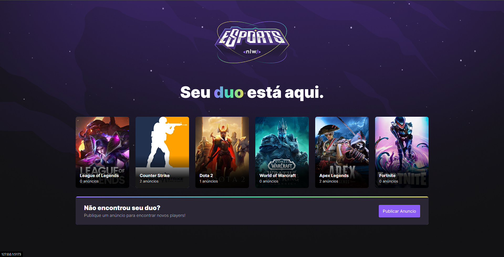
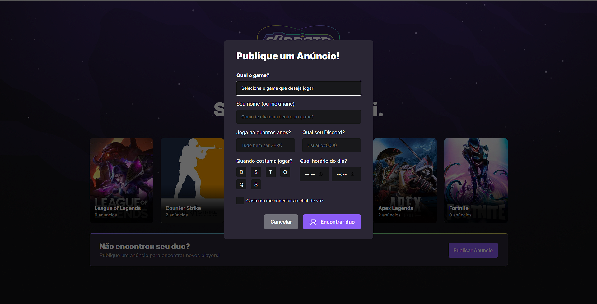

## Projeto feito na NLW-eSports da Rocketseat

Meu primeiro projeto feito com Vite utilizando TypeScript, o conceito deste site é publicar abuncios para achar um duo para jogar, utilizei a API com banco de dados de jogos em Prisma [NLW-eSports-Server](https://github.com/M4rcoToni/NWL-eSports-Server), tecnologias utilizadas:

- React
- Radix
- Anxios
- Tailwind

Para do rodar o projeto, cmd na pasta:

### `npm run dev`

## Home

Encontre seu Duo!

Publique seu Anuncio

